# Flask Full Stack Part 1: Frontend Quick Walkthrough

(course by Jose Portilla on Udemy)

<!-- vscode-markdown-toc -->
* 1. [Overview](#Overview)
* 2. [HTML quick reference](#HTMLquickreference)
	* 2.1. [Basic tags, list, div, span, attribute](#Basictagslistdivspanattribute)
		* 2.1.1. [HTML Attributes](#HTMLAttributes)
	* 2.2. [HTML Forms](#HTMLForms)
		* 2.2.1. [Form Selections](#FormSelections)
* 3. [CSS Crash Course](#CSSCrashCourse)
	* 3.1. [Colors](#Colors)
	* 3.2. [Backgrounds and Borders](#BackgroundsandBorders)
	* 3.3. [`class` and `id`: CSS Selector](#classandid:CSSSelector)
	* 3.4. [Inspect Elements in Browser](#InspectElementsinBrowser)
	* 3.5. [Fonts](#Fonts)
* 4. [Bootstrap 4](#Bootstrap4)
	* 4.1. [Buttons](#Buttons)
		* 4.1.1. [Class `jumbotron`](#Classjumbotron)
	* 4.2. [Forms](#Forms)
	* 4.3. [Navbar](#Navbar)

<!-- vscode-markdown-toc-config
	numbering=true
	autoSave=true
	/vscode-markdown-toc-config -->
<!-- /vscode-markdown-toc -->

##  1. <a name='Overview'></a>Overview

Flask is a super simple Python web framework and is also scalable with a lot of 3rd party libraries. Choosing Flask rather than
NodeJS because Python has nice ecosystem in machine learning. What Flask does in general:

- Connect with UI
- Connect to database and handle CRUD (create, read, update, delete)

For example, it can handle HTML forms via library `WTForms`. SQLite is sufficient as a database for a small website.

Flask is a middle man between the frontend UI and the database backend.

We will use Jinja templates to grab information from Python and Flask to send as HTML.

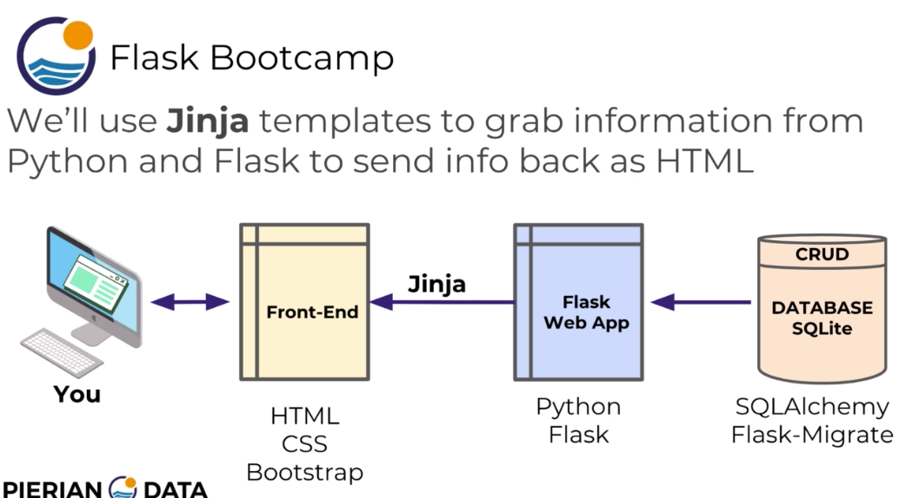

##  2. <a name='HTMLquickreference'></a>HTML quick reference

`<!DOCTYPE html>` tells it's an html file. `<head>` contains metadata, title on the tab and links to javascript, `<body>` contains content such as forms, styles, headers, etc.

###  2.1. <a name='Basictagslistdivspanattribute'></a>Basic tags, list, div, span, attribute

`<h1>`: heading one

`<h6>`: heading six

`<p>`: paragraph

`<strong>`: bold

`<em>`: italics

`<br>`: line break

For full reference, go to [Mozilla HTML elements reference](https://developer.mozilla.org/en-US/docs/Web/HTML/Element).

[CodePen](https://codepen.io/) and [JSFiddle](https://jsfiddle.net/) are good online test grounds.

`<ol>`: ordered list

`<li>`: list item

`<ul>`: unordered list

Lists can be nested.

`<div>` stands for division.

`<div>` and `<span>` can separate the HTML page into sections.

`<div>` is for larger division/block of elements, `<span>` is for substring such as

```html
<p>Here is <span class='myclass'>some text</span>. woohoo! </p>
```

for doing styling on `myclass`.

####  2.1.1. <a name='HTMLAttributes'></a>HTML Attributes

`" alt="Uh oh! No image">`

`<link to image>` can be an url online or a path to local file. Next sections will show how to organize static files in Flask.

`<a href="<some url>">My link here</a>`

Again, `<some url>` can be an URL online or a path to another html file locally.

Note that `` is a self closing tag but `<a>` is not.

###  2.2. <a name='HTMLForms'></a>HTML Forms

Consist of `<form>` and `<input>` tags.

Example 1 (from code example Forms Basics)

```html
<form>

    <h1>Log In</h1>
    <h2>Please Input your Password and Email</h2>
    <input type="email" name="useremail" value="Email Here">
    <input type="password" name="password" value="Password">
    <input type="submit" name="" value="Enter">

    <h1>Choose a Color!</h1>
    <h2>Click on the Button when ready</h2>
    <input type="color" >
    <h2>Enter some Text!</h2>
    <input type="text" name="" value="Text goes here">

</form>
```

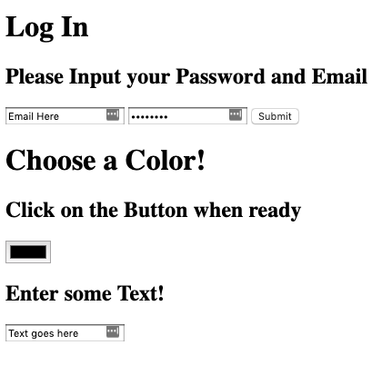

The `email` input type will let the browser check if it's a valid email with `@`. `value` is prefilled.

The `password` type hides the input in the box. `value` is what's prefilled and hidden.

The `submit` type is a button where `value` has the text shown on the button.

The `color` type is interesting but not commonly used, it lets you select from a color palette.

`GET` will send back the info to our **action** URL.

`POST` submits data to be processed.

Forms must set label for each text box in order to let the user see which field is which **in the UI**. The `for` in `<label>` must match the `id` in `<input>` to label the input properly.

Example: (from example Form Labels)

```html
<!-- Upon submitting the form will perform the action (a redirect) -->
    <form action="http://www.google.com" method="get">

      <label for="email">EMAIL:</label>
      <input type="email" id="email" name="useremail" value="Email Here">


      <label for="pass">PASSWORD:</label>
      <input type="password" id="pass" name="password" placeholder="Password">

      <!-- Validation -->
      <!--  Usually do a lot more validation with Backend-->
      <!--  Use the attribute: required to require input-->

      <label for="userinput">TEXT:</label>
      <input type="text" id="userinput" name="input" placeholder="Enter Text Here" required>

      <input type="submit" >

    </form>
```

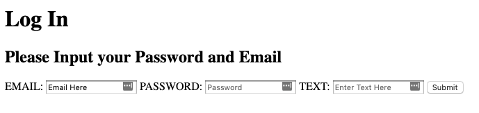

`action` is the action that gets triggered upon form submission. Making it an URL is a redirect.

`value` in the text input type tag is a pre-populated string that is shown in the text input box before typing. It is also the value that actually gets submitted for the field.

`placeholder` is a hint to the user when the field is empty and it is greyed out.

For type "password", `value` is prefilled and hidden, `placeholder` is a hint without actual filled value and is not hidden.

####  2.2.1. <a name='FormSelections'></a>Form Selections

When two input `radio` buttons share the same `name`, only one can be selected.

Example: (from example form seletions)

```html
        <form method="get">
          <h3>Do you already own a dog?</h3>
          <label for="yes">Yes</label>
          <input type="radio" id="yes" name="dog_choice" value="yes">

          <label for="no">No:</label>
          <input type="radio" id="no" name= "dog_choice" value="no">

          <p>How clean is your house (Rated 1-3 with 3 being cleanest))</p>
          <select name="stars">
            <option value="Great">3</option>
            <option value="Okay">2</option>
            <option value="Bad">1</option>
          </select>

          <p>Any other comments?</p>

          <textarea name="name" rows="8" cols="80"></textarea>

          <input type="submit" name="" value="Submit Feedback">

        </form>
```

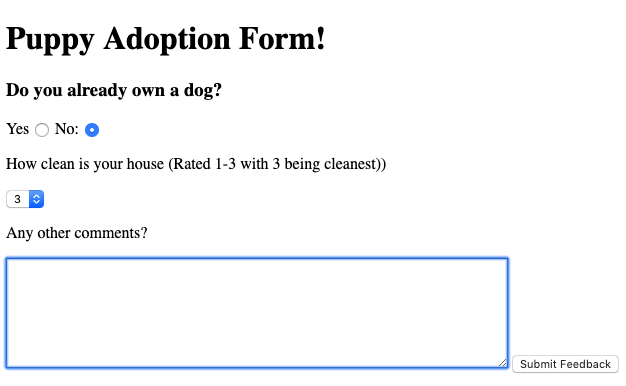

`<select>` gives a dropdown selection of `<option>`s. Each option has a `value`. The `value` of the option selected will be assigned to `name` (variable name) of the `<select>` and the backend can see `name = value` for this dropdown.

`<textarea>` is a big text box which can be set with # rows and columns.

Note that `<submit>`'s value is just the string shown on the submit button.

Once hit submit, the URL will be updated and a part in the format `?name=value&name=value&name=value` will be appended.

##  3. <a name='CSSCrashCourse'></a>CSS Crash Course

CSS = Cascading Style Sheet

CSS controls the color, background, borders and much more.

1. Create a `.css` file
2. Use CSS syntax to link element tags
3. Add style name-value pairs
4. Connect CSS to HTML

###  3.1. <a name='Colors'></a>Colors

Example: (from Part1_master/css)

```css
/*Colors can be names, or codes*/

h1{
  color: blue;
}

li {
  color: rgb(0,200,0);
}

/*Search Google for hex color, it has a hex color picker*/
p{
  color: #000000;
}

/*a is alpha, controls transparency, 1 is fully opaque, 0 fully transparent*/
h4{
  color: rgba(13,90,140,0.5)
}
```

The general format is shown below, don't forget the `;`

```css
Selected Tag {
  property: value;
}
```

To link the CSS file to HTML, add the following in the `<head>` section to the HTML.

```html
<link rel="stylesheet" href="Part1_master.css">
```

`rel` is the relationship attribute of the link, it says the CSS is a `stylesheet` of the HTML.

`href` points to the path of the CSS file.

The final result is shown below.

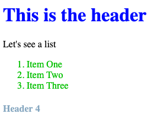

###  3.2. <a name='BackgroundsandBorders'></a>Backgrounds and Borders

Example: (from Part2_master.css)

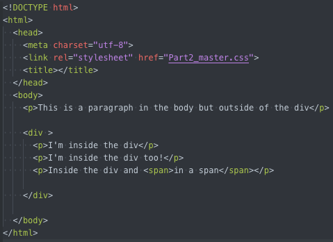

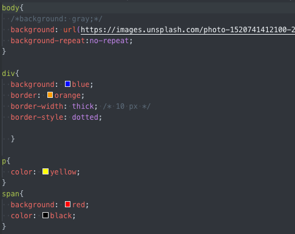

`background` can be an url to an image, set `no-repeat` to avoid tiling. `background-repeat` can be `repeat-x` or `repeat-y` for x and y axis only.

For `border`, `border-style` and `border-width` are required attributes. Use one line to avoid 3

```css
border: orange 10px dashed;
```

Final result:


###  3.3. <a name='classandid:CSSSelector'></a>`class` and `id`: CSS Selector

**This is the most important one for CSS. We can select by `id` or `class`.**

Every HTML element can accept a `class` or `id` attribute. CSS can link to them by

- `.` for `class`
- `#` for `id`

**`class`s are for styling multiple different elements.**

**`id`s are for a single and unique element.**

Example: from CSS Part3

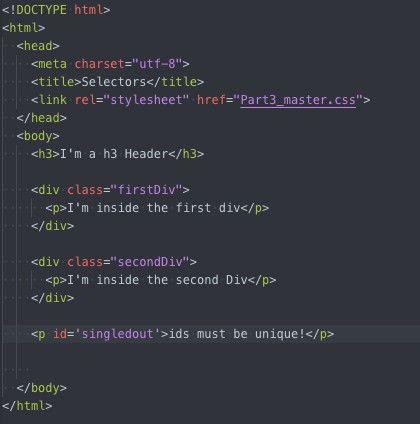

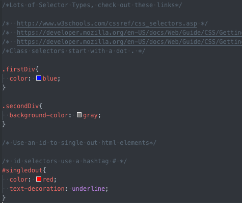

Later, Bootstap will define classes for us.

**To summarize, CSS can style the HTML based on tags, classes and ids.**

###  3.4. <a name='InspectElementsinBrowser'></a>Inspect Elements in Browser

In Chrome we can inspect the HTML and CSS in the developer tool. We can even edit it locally to see changes. For example, open Google and change it's styling locally.

To go back to the original site, just hit refresh.

###  3.5. <a name='Fonts'></a>Fonts

Not every font is available on each OS. Mac, Windows and Linux have different fonts.

Use [Google Fonts API](https://fonts.google.com/) to change fonts.

1. Add a link to Google fonts API in the HTML
2. Add the name for the `font-family` from Google Fonts API.

You can get the link and name from the Google Fonts webpage.

Example: look at CSS Part5 files

##  4. <a name='Bootstrap4'></a>Bootstrap 4

Bootstrap is a CSS framework originally developed at Twitter for internal use. It was open sourced in 2011 and became one of the most starred projects on Github.

####  <a name='WhatisBootstrap'></a>What is Bootstrap?

Conceptually, Bootstrap is a really large CSS file + a really large JS file.

Check out the [documentation](https://getbootstrap.com/docs/4.3/getting-started/introduction/) and [templates](https://getbootstrap.com/docs/4.3/examples/)

[This](https://getbootstrap.com/docs/4.3/examples/dashboard/) is a template for a dashboard.

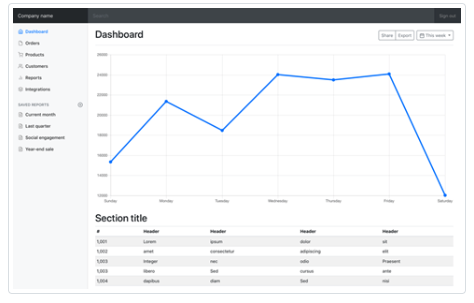

Key concepts: bootstrap components and classes

- Linking Bootstrap
- Containers
- Jumbotrons
- Buttons

###  4.1. <a name='Buttons'></a>Buttons

In the `<head>` section in the HTML,

- Copy and paste the CSS link

`<link rel="stylesheet" href="https://stackpath.bootstrapcdn.com/bootstrap/4.3.1/css/bootstrap.min.css" integrity="sha384-ggOyR0iXCbMQv3Xipma34MD+dH/1fQ784/j6cY/iJTQUOhcWr7x9JvoRxT2MZw1T" crossorigin="anonymous">`

- Copy and paste the jQuery link

```html
<script src="https://code.jquery.com/jquery-3.3.1.slim.min.js" integrity="sha384-q8i/X+965DzO0rT7abK41JStQIAqVgRVzpbzo5smXKp4YfRvH+8abtTE1Pi6jizo" crossorigin="anonymous"></script>
<script src="https://cdnjs.cloudflare.com/ajax/libs/popper.js/1.14.7/umd/popper.min.js" integrity="sha384-UO2eT0CpHqdSJQ6hJty5KVphtPhzWj9WO1clHTMGa3JDZwrnQq4sF86dIHNDz0W1" crossorigin="anonymous"></script>
<script src="https://stackpath.bootstrapcdn.com/bootstrap/4.3.1/js/bootstrap.min.js" integrity="sha384-JjSmVgyd0p3pXB1rRibZUAYoIIy6OrQ6VrjIEaFf/nJGzIxFDsf4x0xIM+B07jRM" crossorigin="anonymous"></script>
```

Add containers next. The containers are responsive and can self-adjust the position based on browser size on different devices.

Then add a button. Go to Bootstrap -> components -> buttons, copy and paste the code there, mainly need the class names e.g. `btn btn-primary`.

```html
<button class="btn btn-success btn-lg active" type="button" name="button">Button</button>
```

Same for other components. Be comfortable searching the [Component](https://getbootstrap.com/docs/4.3/components/buttons/) section and copy paste around.

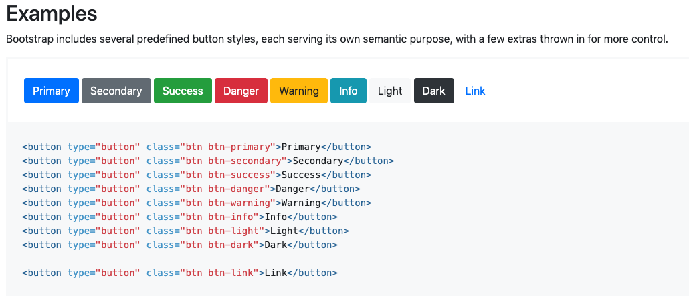

####  4.1.1. <a name='Classjumbotron'></a>Class `jumbotron`

A showcase message for the website.

Example:

```html
<!-- JumboTron -->
  <div class="container">


    <div class="jumbotron">
      <!-- <div class="container"> -->


      <h1 class="display-3">Hello, world!</h1>
      <p class="lead">This is a simple hero unit, a simple jumbotron-style component for calling extra attention to
        featured content or information.</p>
      <hr class="my-2">
      <p>It uses utility classes for typography and spacing to space content out within the larger container.</p>
      <p class="lead">
        <a class="btn btn-primary btn-lg " href="#" role="button">Learn more</a>
      </p>
      <!-- </div> -->
    </div>
  </div>
```

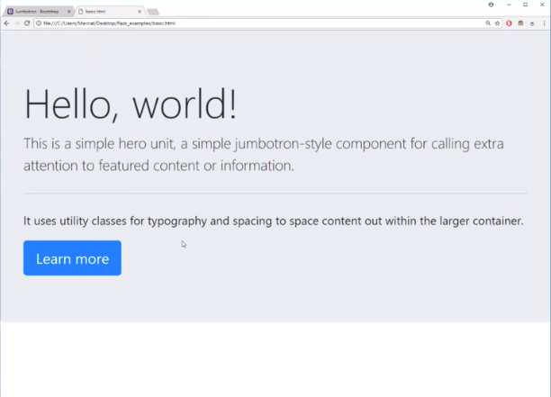

###  4.2. <a name='Forms'></a>Forms

In `<head>` include

```html
    <!-- Bootstrap CSS, JS, and jQuery -->
    <link rel="stylesheet" href="https://stackpath.bootstrapcdn.com/bootstrap/4.1.1/css/bootstrap.min.css" integrity="sha384-WskhaSGFgHYWDcbwN70/dfYBj47jz9qbsMId/iRN3ewGhXQFZCSftd1LZCfmhktB" crossorigin="anonymous">
    <script src="https://code.jquery.com/jquery-3.3.1.slim.min.js" integrity="sha384-q8i/X+965DzO0rT7abK41JStQIAqVgRVzpbzo5smXKp4YfRvH+8abtTE1Pi6jizo" crossorigin="anonymous"></script>
    <script src="https://cdnjs.cloudflare.com/ajax/libs/popper.js/1.14.3/umd/popper.min.js" integrity="sha384-ZMP7rVo3mIykV+2+9J3UJ46jBk0WLaUAdn689aCwoqbBJiSnjAK/l8WvCWPIPm49" crossorigin="anonymous"></script>
    <script src="https://stackpath.bootstrapcdn.com/bootstrap/4.1.1/js/bootstrap.min.js" integrity="sha384-smHYKdLADwkXOn1EmN1qk/HfnUcbVRZyYmZ4qpPea6sjB/pTJ0euyQp0Mk8ck+5T" crossorigin="anonymous"></script>
```

Bootstrap 4 makes forms look really well.

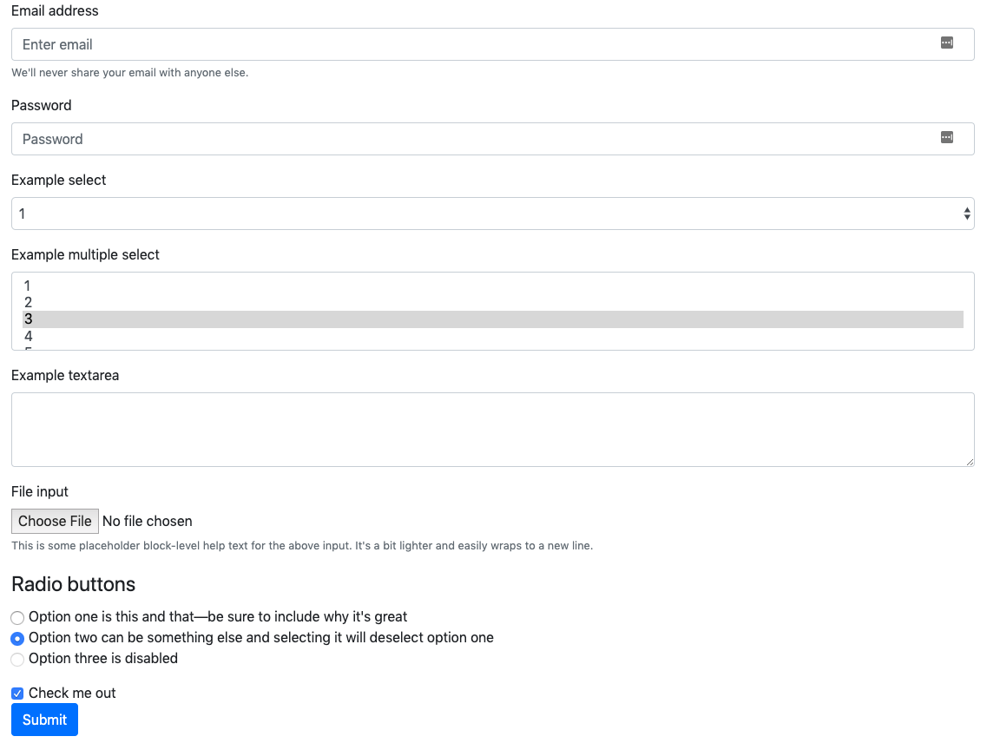

All of these form components such as **email submission, password, dropdown select, multiple select, text area, file upload, radio button, check button** should use proper `div`, `select` and `input` with bootstrap class names. Refer to `Part2_Forms.html` for actual HTML code for each component.

###  4.3. <a name='Navbar'></a>Navbar

HTML tag `<nav>` creates a navigation bar. Bootstrap classes can be added to it to add styling and functionality. It even makes it a dropdown menu on small screens of mobile devices.

Refer to `Part3_Navbar.html` for code examples. One thing to note is that we need jQuery `uncompressed` or `minified`, not `slim` or `slim minified` as in Bootstrap. Go to the [jQuery](https://code.jquery.com/) website and get the link for `minified`

```html
<script
  src="https://code.jquery.com/jquery-3.4.1.min.js"
  integrity="sha256-CSXorXvZcTkaix6Yvo6HppcZGetbYMGWSFlBw8HfCJo="
  crossorigin="anonymous"></script>
```

The reason is that the `slim` version of jQuery from Bootstrap sometimes has problems for the collapse functionality for certain browsers.

Check the [documentation](https://getbootstrap.com/docs/4.3/components/navbar/) for further customizations as needed.


###  <a name='THEEND'></a>THE END

THIS IS A QUICK CRASH COURSE FOR HTML, CSS AND BOOTSTRAP.

FOR FURTHER **FRONTEND** KNOWLEDGE, CHECK OUT THE FOLLOWING UDEMY COURSES

- [The Complete Web Developer in 2019: Zero to Mastery](https://www.udemy.com/the-complete-web-developer-zero-to-mastery/) by [Andrei Neagoie](https://twitter.com/AndreiNeagoie)
- [React - The Complete Guide (incl Hooks, React Router, Redux)](https://www.udemy.com/react-the-complete-guide-incl-redux/) by [Maximilian Schwarzmüller](https://twitter.com/maxedapps?lang=en)

